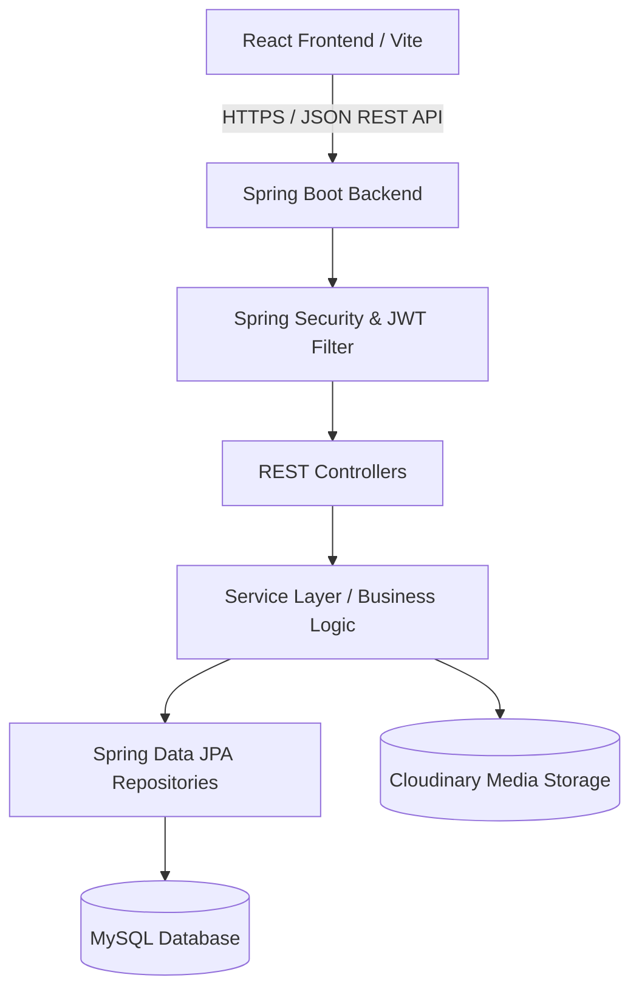
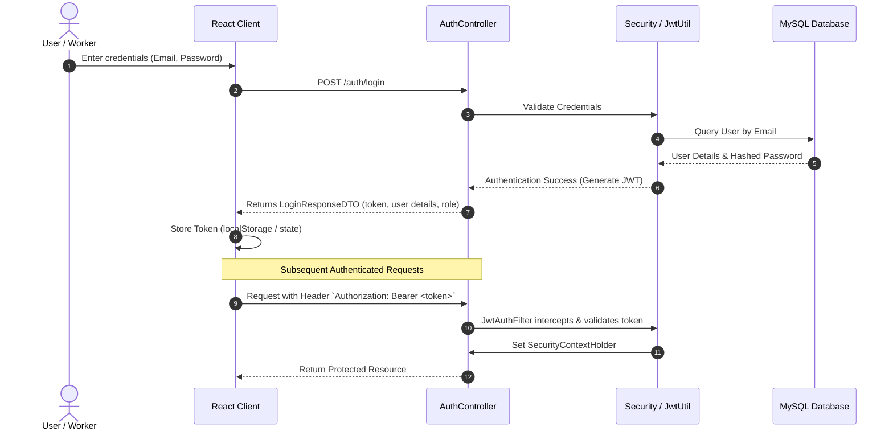
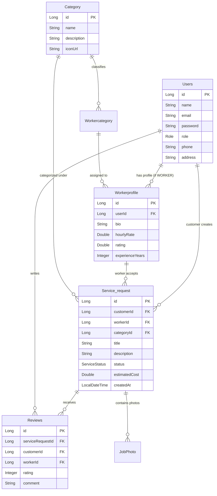
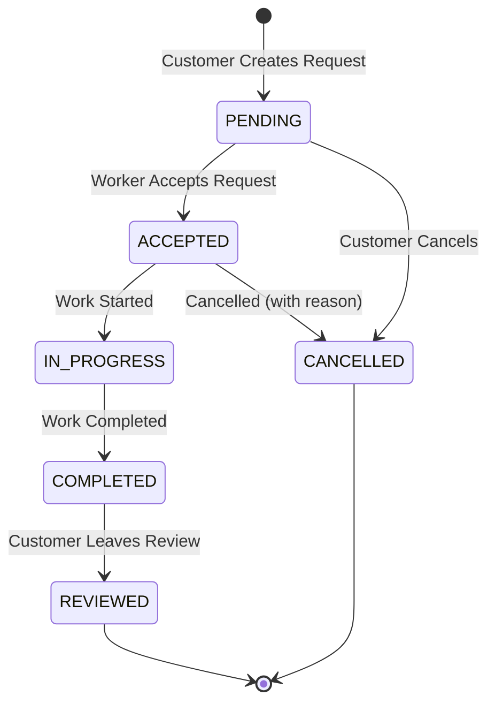

# Workers' Den - System Architecture

This document provides a comprehensive overview of the **Workers' Den** platform architecture, detailing the backend system structure, component interactions, security model, and data schemas.

---

## 1. High-Level Architecture Overview

Workers' Den is designed as a decoupled client-server architecture:
- **Frontend**: Single Page Application built with modern React / Vite, providing customer, worker, and admin interfaces.
- **Backend**: Spring Boot 4 REST API powering business logic, user authentication, service lifecycle management, and ratings.
- **Storage & Infrastructure**:
  - **MySQL**: Relational storage for users, worker profiles, categories, service requests, and reviews.
  - **Cloudinary**: Cloud-based storage for job attachments and worker profile images.



---

## 2. Backend Package Structure (`com.workersden`)

The backend follows clean layered architecture principles organized under `com.workersden`:

```
backend/src/main/java/com/workersden/
├── config/                  # Configuration beans (Cloudinary, Web MVC, Database Seeder)
├── controller/              # REST API Controllers (endpoints for Auth, Users, Jobs, Reviews)
├── dto/
│   ├── request/             # Request payload DTOs with validation annotations
│   └── response/            # Response payload DTOs for client consumption
├── entity/                  # JPA Database Entities & Enums (Role, ServiceStatus, etc.)
├── exception/               # Global Exception Handler and custom runtime exceptions
├── repository/              # Spring Data JPA Repository interfaces
├── security/                # JWT Utilities, JWT Authentication Filter, Security Filter Chain
└── service/                 # Service interfaces and business logic implementations
```

---

## 3. Security & Authentication Flow

Workers' Den uses stateless JSON Web Token (JWT) based authentication:



---

## 4. Entity-Relationship Model (Domain)



---

## 5. Service Request Lifecycle State Machine

Service requests transition through explicit, validated states:



---

## 6. Media Upload Flow (Cloudinary)

1. Client uploads job/profile image via `POST /api/upload`.
2. Backend receives `MultipartFile`, verifies size and MIME type.
3. Service streams the file to Cloudinary via `com.cloudinary:cloudinary-http5`.
4. Secure CDN URL is returned to the client and saved in entity records (`JobPhoto`, `Workerprofile`).
